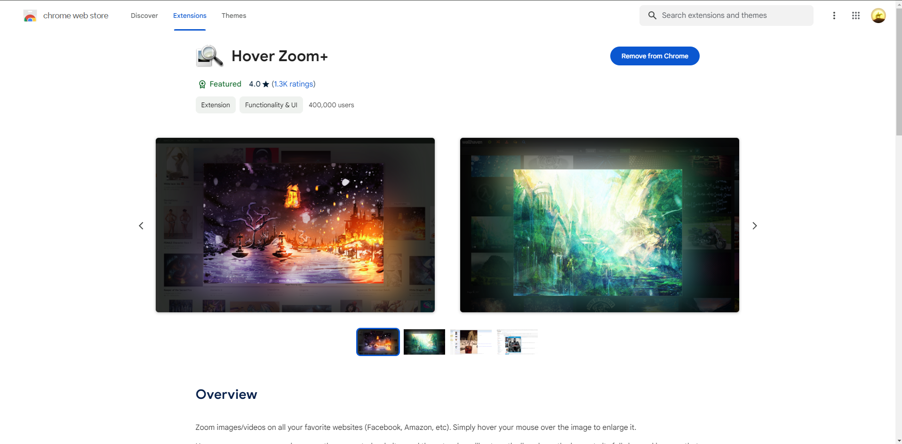
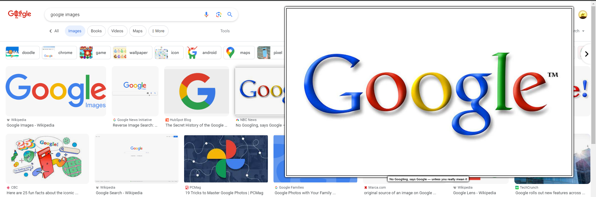
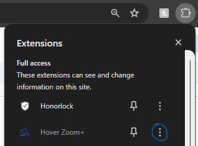
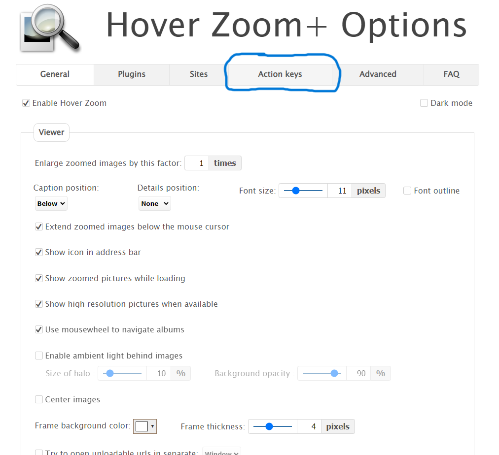

  
# Hover Zoom+

Zoom images/videos on an ever growing list of popular websites. Hover your mouse over any image or video on the [supported websites](https://github.com/extesy/hoverzoom/tree/master/plugins) and the extension will enlarge the image to its full size, making sure that it still fits into the browser window.

Supported Websites

  
- Facebook
- Google Images
- Amazon
- Twitch
- Many more to come!

  
# Helpful Tips

## Installation 
- Navigate to your browser's extension marketplace (Google Chrome, Mozilla Firefox, or Microsoft Edge) and search for Hover Zoom. The extension page should look something like this:
  

## How to Use
- By default, the extension is set to work automatically, which means any image on any supported site will pop up on its own, without any further input. When used, it should look something like this:

- However, you may find this annoying, and you may not want every image you scroll over to pop up. This is why we have implemented the ability to tie this extension to a hotkey. To enable this, you will first want to access the extension settings.
On Google Chrome, click the 3 dots shown below, the select options.

It should be in a similar location for Microsoft Edge and Mozilla Firefox, just look for those 3 dots next to the extension wherever those are located in your browser of choice

- Next, click on the Action keys tab, which should be here:

- In the setting "Activate HoverZoom+, select the key you would like to set as the hotkey (ie shift or ctrl). 

- Scroll to the bottom of the page and select "Save", and your changes should be applied.

## And that's about it! There are some other settings you can change, such as image transformation, background color, etc, but now it should be set up and functional. We hope you enjoy using HoverZoom+!
### Please refer to the list of supported website listed above.

# Installation 
- Navigate to your browser's extension marketplace (Google Chrome, Mozilla Firefox, or Microsoft Edge) and search for Hover Zoom. The extension page should look something like this:

> **This extension will never be sold out, and it will never compromise users' privacy. 
> As a proof, please see [the list](https://github.com/extesy/hoverzoom/discussions/670) of all takeover offers I have received over the last few years.**

> Please help with [localizing this extension](https://crowdin.com/project/hoverzoom) to the language you are familiar with!

---

This is an open-source version of the original HoverZoom extension, which is now overrun by malware and deleted from the store. In this version all spyware has been removed, many bugs were fixed and new features were added. It doesn't collect any statistics whatsoever. The only permission it needs is to access data on all websites (to extract full images), and *optional* permissions to access browser history, download/save images, or get tab URLs for per-site configuration.

Sometimes sites change design, and when it happens, the extension needs to be updated. Please report any issues with zooming not working by filing an issue on https://github.com/extesy/hoverzoom/issues page.

[Google Chrome](https://chrome.google.com/webstore/detail/hover-zoom%20/pccckmaobkjjboncdfnnofkonhgpceea)  • [Mozilla Firefox](https://addons.mozilla.org/en-US/firefox/addon/hover-zoom-plus/)  • [Microsoft Edge](https://microsoftedge.microsoft.com/addons/detail/hover-zoom/bnibclmindjpdfiipicpdhljfblkpkml) 
---

Licensed under MIT license.
